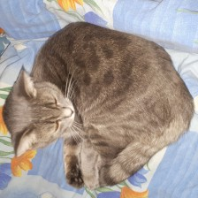

```python
from IPython.display import display, display_jpeg, Image
```


```python
cat_image_filename = 'images/cat.jpg'
print('Image output with `Image` from `IPython`.')
Image(cat_image_filename)
```
!!! output ""  
    Image output with `Image` from `IPython`.


    

    


```python
dog_image_filename = 'images/dog.jpg'
display(Image(dog_image_filename))
print('Output with `display` from `IPython`')
dog_image_filename
```


    

!!! output ""  
    Output with `display` from `IPython`
!!! output ""  
    'images/dog.jpg'


